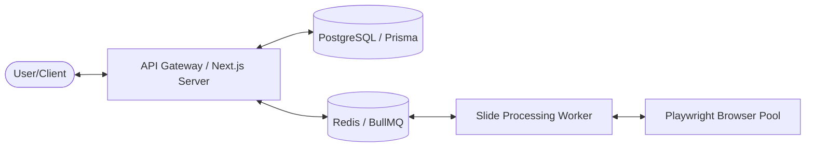

# Slides-Grab API Backend Tech Stack Proposal

본 문서는 `slides-grab` 프레임워크의 3단계 파이프라인(Planning → Design → Conversion)을 안정적으로 구동하고, 에이전트와 사용자 간의 실시간 상호작용을 지원하기 위한 **Node.js 중심의 API 백엔드 기술 스택**을 제안합니다.

## 1. 아키텍처 개요: "Worker-Queue" 패턴

슬라이드 생성 및 이미지 렌더링은 긴 처리 시간이 소요되는 작업입니다. 이를 메인 API 스레드에서 분리하여 안정성을 확보하는 **Worker-Queue 기반 비동기 아키텍처**를 권장합니다.

## 2. 추천 기술 스택 (Core Stack)

| 구분 | 추천 기술 (Stack) | 선정 이유 |
| :--- | :--- | :--- |
| **Framework** | **Next.js 15+ (App Router)** | API Routes와 Dashboard UI를 통합 개발 가능하며, 프레임워크 내 강력한 타입 안정성 제공. |
| **Interface** | **Fastify / Express** | (선택사항) 고성능 처리가 필요한 별도 Worker 서비스 구축 시 가벼운 Node.js 코어 프레임워크 사용. |
| **ORM** | **Prisma** | 스키마 중심의 Type-safe 데이터 접근이 가능하며, PostgreSQL/SQLite 등 다양한 DB 지원. |
| **Task Queue** | **BullMQ (Redis 기반)** | Playwright 작업, AI 에이전트 생성 작업 등을 안정적으로 큐잉하고 재시도 로직 구현 가능. |
| **Real-time** | **Socket.io** | 슬라이드 생성 진행 상황(Status update) 및 실시간 협업 편집 지원. |
| **AI Orchestrator** | **LangGraph** | 3단계 파이프라인(Planning → Design → Export)의 상태를 관리하고 복합 워크플로우 제어. |
| **Validation** | **Zod** | API 요청/응답 및 프롬프트 결과물의 런타임 타입 검증. |

---

## 3. 핵심 기능별 상세 기술 전략

### A. 슬라이드 렌더링 및 에셋 관리
- **Playwright Pool**: `AGENTS.md` 규칙에 따라 브라우저 인스턴스를 재사용하여 성능 최적화.
- **Sharp**: 이미지 리사이징, 크로핑, 포맷 변환(HTML → PNG/WebP) 처리.
- **Local/Cloud Storage**: 로컬 개발 시에는 `/slides/assets`를 사용하고, 운영 환경에서는 S3 호환 스토리지를 추상화 라이브러리로 관리.

### B. 에이전트 워크플로우 관리
- **LangGraph State Management**: 사용자의 승인(Approval) 단계에서 멈추고 피드백을 받아 재개(Resume)하는 "Human-in-the-loop" 워크플로우 구현.
- **Server-Sent Events (SSE)**: 에디터 런타임의 로그 스트리밍 및 진행률 표시 (`editor-server.js`의 구현 확장).

### C. 파일 시스템 연동
- **Chokidar**: 슬라이드 파일 변경을 백엔드에서 실시간으로 감지하여 클라이언트에 푸시.

---

## 4. 인프라 및 배포 전략

- **Containerization**: `Dockerfile`을 통해 Playwright 실행에 필요한 시스템 라이브러리(Chromium deps)를 포함한 환경 구축.
- **Local-First Support**: 사용자가 자신의 환경에서 `npx slides-grab`으로 즉시 실행 가능하도록 **SQLite**를 기본 데이터베이스 옵션으로 제공.

## 5. 단계별 도입 로드맵

1.  **Phase 1 (Stabilization)**: 기존 `scripts/editor-server.js`를 Express 기반의 깔끔한 API 서비스로 리팩토링 및 Prisma 도입.
2.  **Phase 2 (Queueing)**: BullMQ를 도입하여 백그라운드 슬라이드 생성 환경 구축.
3.  **Phase 3 (Agent-First)**: LangGraph를 백엔드로 이관하여 복합적인 AI 슬라이드 설계 엔진 구현.

---

> [!TIP]
> **왜 Next.js와 Worker를 분리하나요?**  
> Vercel 같은 Serverless 환경에서는 Playwright의 GPU 가속이나 긴 실행 시간(Timeout)을 감당하기 어렵습니다. 따라서 UI와 간단한 API는 Next.js로, 무거운 작업은 Docker 기반의 전용 Node.js Worker에서 처리하는 구성이 가장 안정적입니다.
